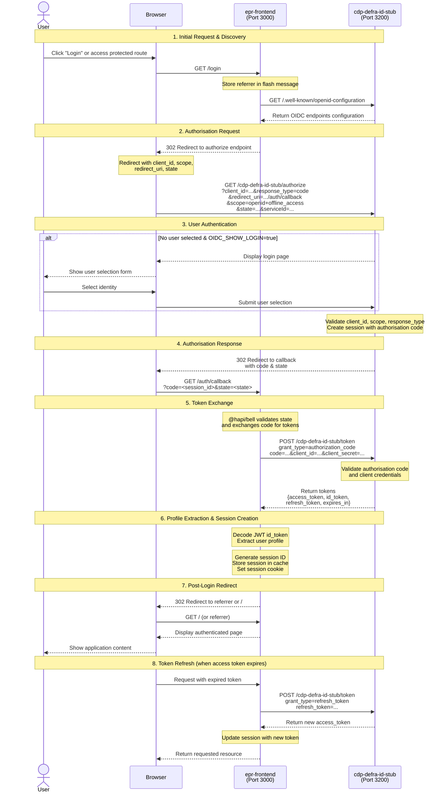

# Defra ID OIDC Authentication Flow

This document describes the OpenID Connect (OIDC) authentication flow between the `epr-frontend` application and the `cdp-defra-id-stub` identity provider stub.

## Overview

The authentication system uses the standard OAuth 2.0 Authorisation Code flow with PKCE (Proof Key for Code Exchange) support. The `epr-frontend` acts as the OIDC client (Relying Party), while `cdp-defra-id-stub` acts as the OIDC Provider (Identity Provider).

## System Components

### epr-frontend (Port 3000)

- **Framework**: Hapi.js
- **Auth Library**: `@hapi/bell` (OAuth 2.0/OIDC plugin)
- **Key Routes**:
  - `/login` - Initiates the OIDC flow
  - `/auth/callback` - Handles the callback from the identity provider
- **Key Configuration**:
  - Client ID: `63983fc2-cfff-45bb-8ec2-959e21062b9a`
  - Client Secret: `test_value`
  - Discovery URL: `http://localhost:3200/cdp-defra-id-stub/.well-known/openid-configuration`

### cdp-defra-id-stub (Port 3200)

- **Framework**: Hapi.js
- **Purpose**: Mock Defra ID identity provider for local development
- **Key Routes**:
  - `/.well-known/openid-configuration` - OIDC discovery endpoint
  - `/cdp-defra-id-stub/authorize` - Authorisation endpoint
  - `/cdp-defra-id-stub/token` - Token exchange endpoint
  - `/cdp-defra-id-stub/login` - User selection page
  - `/cdp-defra-id-stub/logout` - Logout endpoint
  - `/.well-known/jwks.json` - JSON Web Key Set for token verification

## Authentication Flow: User Perspective

### 1. User Initiates Login

A user navigating to the epr-frontend application either:

- Clicks a "Login" link/button that points to `/login`
- Attempts to access a protected route and is redirected to `/login`
- The referrer URL is stored in a flash message for post-login redirect

**Code Reference**: `src/server/login/controller.js:7-11`

### 2. Frontend Discovers OIDC Configuration

When the defra-id plugin initializes, it fetches the OIDC configuration from the stub's discovery endpoint:

```
GET http://localhost:3200/cdp-defra-id-stub/.well-known/openid-configuration
```

This returns the authorisation and token endpoints that will be used in the flow.

**Code Reference**: `src/server/common/helpers/auth/defra-id.js:24-27`

### 3. Redirect to Authorisation Endpoint

The `@hapi/bell` plugin automatically redirects the user's browser to the stub's authorisation endpoint with the following parameters:

```
GET http://localhost:3200/cdp-defra-id-stub/authorize
  ?client_id=63983fc2-cfff-45bb-8ec2-959e21062b9a
  &response_type=code
  &redirect_uri=http://localhost:3000/auth/callback
  &scope=openid+offline_access
  &state=<random_state>
  &serviceId=d7d72b79-9c62-ee11-8df0-000d3adf7047
```

**Code Reference**: `src/server/common/helpers/auth/defra-id.js:30-84`

### 4. User Selects Identity

The stub application:

- Checks if a user parameter is provided in the query string
- If not, and `OIDC_SHOW_LOGIN=true`, displays a login page with available test users
- The user selects their identity from the available options
- If no users exist, redirects to a registration flow

**Code Reference**: `cdp-defra-id-stub/src/server/oidc/controllers/authorize-controller.js:18-29`

### 5. Authorisation Code Generation

Once a user is selected, the stub:

- Validates the client_id, response_type, scope, and other parameters
- Creates a session with user information and the authorisation code
- Redirects back to the frontend's callback URL with:
  - `code` - Authorisation code
  - `state` - State parameter for CSRF protection

```
Redirect to: http://localhost:3000/auth/callback?code=<session_id>&state=<state>
```

**Code Reference**: `cdp-defra-id-stub/src/server/oidc/controllers/authorize-controller.js:91-105`

### 6. Token Exchange

The frontend's callback handler (managed by `@hapi/bell`) automatically exchanges the authorisation code for tokens by making a POST request to the token endpoint:

```
POST http://localhost:3200/cdp-defra-id-stub/token
Content-Type: application/x-www-form-urlencoded

grant_type=authorization_code
&code=<authorisation_code>
&client_id=63983fc2-cfff-45bb-8ec2-959e21062b9a
&client_secret=test_value
&redirect_uri=http://localhost:3000/auth/callback
```

The stub validates the request and returns:

- `access_token` - JWT access token
- `id_token` - JWT ID token (when `openid` scope is requested)
- `refresh_token` - Token for refreshing access (when `offline_access` scope is requested)
- `token_type` - "bearer"
- `expires_in` - Token expiration time in seconds (3600)

**Code References**:

- `cdp-defra-id-stub/src/server/oidc/controllers/token-controller.js:39-46`
- `cdp-defra-id-stub/src/server/oidc/controllers/token-controller.js:65-102`

### 7. User Profile Extraction

The frontend extracts user profile information from the JWT token payload:

```javascript
{
  sub: "user_id",
  correlationId: "...",
  sessionId: "...",
  contactId: "...",
  serviceId: "...",
  firstName: "...",
  lastName: "...",
  email: "...",
  uniqueReference: "...",
  loa: "...",  // Level of Assurance
  aal: "...",  // Authentication Assurance Level
  enrolmentCount: 0,
  enrolmentRequestCount: 0,
  currentRelationshipId: "...",
  relationships: [...],
  roles: [...]
}
```

**Code Reference**: `src/server/common/helpers/auth/defra-id.js:46-74`

### 8. Session Creation

The frontend creates a server-side session:

- Generates a unique session ID
- Stores user profile, tokens, and expiration information in the cache
- Sets a secure HTTP-only session cookie (`sessionId`)

**Code Reference**: `src/server/auth/controller.js:14-32`

### 9. Post-Login Redirect

Finally, the user is redirected to:

- The original referrer URL (if stored in flash messages), or
- The home page (`/`)

The user is now authenticated and can access protected resources.

**Code Reference**: `src/server/auth/controller.js:36-38`

## Token Refresh Flow

When the access token expires, the application can use the refresh token to obtain a new access token without requiring the user to log in again:

```
POST http://localhost:3200/cdp-defra-id-stub/token
Content-Type: application/x-www-form-urlencoded

grant_type=refresh_token
&refresh_token=<refresh_token>
&client_id=63983fc2-cfff-45bb-8ec2-959e21062b9a
&client_secret=test_value
```

**Code Reference**: `cdp-defra-id-stub/src/server/oidc/controllers/token-controller.js:47-49`

## Security Features

### Session Management

- **Session Storage**: Server-side cache (Redis in production, memory in development)
- **Session TTL**: 4 hours (configurable via `SESSION_CACHE_TTL`)
- **Cookie Security**: HTTP-only, Secure flag in production

### Token Security

- **JWT Signing**: RS256 algorithm with RSA key pairs
- **Token Expiration**: 1 hour for access tokens, 6 hours for refresh tokens
- **PKCE Support**: The stub supports both `plain` and `S256` code challenge methods

### CSRF Protection

- **State Parameter**: Random state parameter validated during callback
- **Cookie-based Session**: Prevents session fixation attacks

## Configuration

### Enabling Authentication

Authentication is enabled when the `DEFRA_ID_OIDC_CONFIGURATION_URL` environment variable is configured with a valid OIDC discovery endpoint URL. When this variable is not set or empty, authentication routes and strategies are not registered.

The application uses the `isDefraIdEnabled()` helper function to check if the OIDC configuration URL is present and non-empty.

**Code Reference**: `src/config/config.js:277-280`, `src/server/index.js:21,42,79`, `src/server/router.js:27`

### Environment Variables

#### epr-frontend

- `APP_BASE_URL` - base URL for callbacks (default: `http://localhost:3000`)
- `DEFRA_ID_OIDC_CONFIGURATION_URL` - OIDC discovery endpoint (required to enable authentication; when not set or empty, authentication is disabled)
- `DEFRA_ID_SERVICE_ID` - service identifier (default: `d7d72b79-9c62-ee11-8df0-000d3adf7047`)
- `DEFRA_ID_CLIENT_ID` - OAuth client ID (default: `63983fc2-cfff-45bb-8ec2-959e21062b9a`)
- `DEFRA_ID_CLIENT_SECRET` - OAuth client secret (default: `test_value`)
- `SESSION_COOKIE_PASSWORD` - cookie encryption key (min 32 chars)

#### cdp-defra-id-stub

- `APP_BASE_URL` - Stub base URL (default: `http://localhost:3200`)
- `OIDC_BASE_PATH` - Base path for OIDC endpoints (default: `/cdp-defra-id-stub`)
- `OIDC_CLIENT_ID` - Expected client ID
- `OIDC_CLIENT_SECRET` - Expected client secret
- `OIDC_SHOW_LOGIN` - Show login page vs auto-login (default: `true`)

## Sequence Diagram



## Debugging

### Using mitmproxy

The mitmproxy command shown in your setup can be used to intercept and inspect the HTTP traffic between the two applications:

```bash
docker run --rm -it -p 8080:8080 -p 8081:8081 \
    mitmproxy/mitmproxy:latest \
    mitmweb --web-host 0.0.0.0 --web-port 8081 \
    --mode reverse:http://host.docker.internal:3200 \
    --listen-port 8080 \
    --set block_global=false
```

To use this:

1. Update `DEFRA_ID_OIDC_CONFIGURATION_URL` to point to `http://localhost:8080/cdp-defra-id-stub/.well-known/openid-configuration`
2. Access the mitmproxy web interface at `http://localhost:8081`
3. All traffic between epr-frontend and cdp-defra-id-stub will be visible and can be inspected

### Logging

Both applications use Pino for logging. Key events logged during the flow:

**Frontend**:

- OIDC configuration fetch
- Authorisation redirect
- Token exchange
- Session creation: "User has been successfully authenticated"

**Stub**:

- Authorisation requests with client details
- User selection/validation
- Token generation
- Session lookups

Set `LOG_LEVEL=debug` for more detailed logging.

## Testing Scenarios

### Local Development

1. Start cdp-defra-id-stub: `npm run dev` (Port 3200)
2. Start epr-frontend: `npm run dev` (Port 3000)
3. Ensure `DEFRA_ID_OIDC_CONFIGURATION_URL` is set (e.g., `http://localhost:3200/cdp-defra-id-stub/.well-known/openid-configuration`)
4. Navigate to `http://localhost:3000/login`

### Test Users

The stub maintains an in-memory list of test users. You can register new users via the stub's registration interface if needed.

## Key Files Reference

### epr-frontend

- `src/server/common/helpers/auth/defra-id.js` - Defra ID OIDC plugin configuration
- `src/server/auth/controller.js` - OAuth callback handler
- `src/server/login/controller.js` - Login route handler
- `src/config/config.js:241-267` - Defra ID configuration
- `src/config/config.js:277-280` - isDefraIdEnabled() helper function

### cdp-defra-id-stub

- `src/server/oidc/index.js` - OIDC plugin and route registration
- `src/server/oidc/controllers/well-known-openid-configuration.js` - Discovery endpoint
- `src/server/oidc/controllers/authorize-controller.js` - Authorisation endpoint
- `src/server/oidc/controllers/token-controller.js` - Token endpoint
- `src/server/oidc/oidc-config.js` - OIDC configuration
- `src/config/index.js:200-238` - OIDC stub configuration

## Standards & Specifications

This implementation follows:

- [OpenID Connect Core 1.0](https://openid.net/specs/openid-connect-core-1_0.html)
- [OAuth 2.0 Authorisation Code Flow](https://tools.ietf.org/html/rfc6749#section-4.1)
- [PKCE (RFC 7636)](https://tools.ietf.org/html/rfc7636)
- [JWT (RFC 7519)](https://tools.ietf.org/html/rfc7519)
